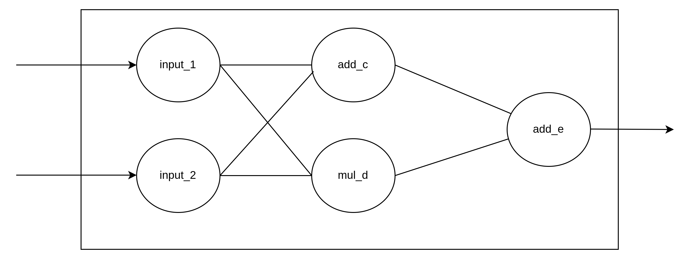

# 基本介紹

Tensorflow 2.x 版本中建議使用Eager Execution作爲主要執行的模式，當然舊的Gaph Execution依然存在，也依然能過使用Version 1的API

如果要使用Graph Execution的話，必須禁用`tf.compat.v1.disable_eager_execution()`，才能順利使用Graph Execution。


## 基本運算

在Tensorflow 2.x 中要進行算，必須先將計算圖封裝於函數中，此外還必需使用`@tf.function`的修飾符號。接著呼叫此函數即可進行此運算圖。

[tf1 code](./base_add_tf1.py)
[tf2 code](./base_add.py)


## 製作一個Simple Network

[code](./base_simple_network.py)

 
可以發現運用剛剛提到的`@tf.function`來製作如圖上面那樣的network其實比想像中的容易許多，只需要把需要的運算寫在函數中，接著把輸入參數寫入即可完成對應的運算。

```python
import tensorflow as tf

@tf.function
def SimpleNetwork(a,b):
    
    c=tf.multiply(a,b,name="mul_c")
    b=tf.add(a,b,name="add_d")
    e = tf.add(c,b,name="add_e")

    return e

input_1 = tf.constant([2,3],name="input_1")
input_2 = tf.constant([3,7],name="input_2")

tf.print(SimpleNetwork(input_1,input_2))
```


