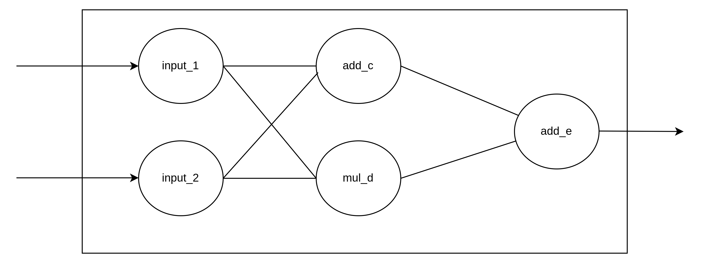
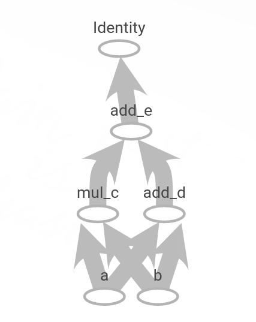
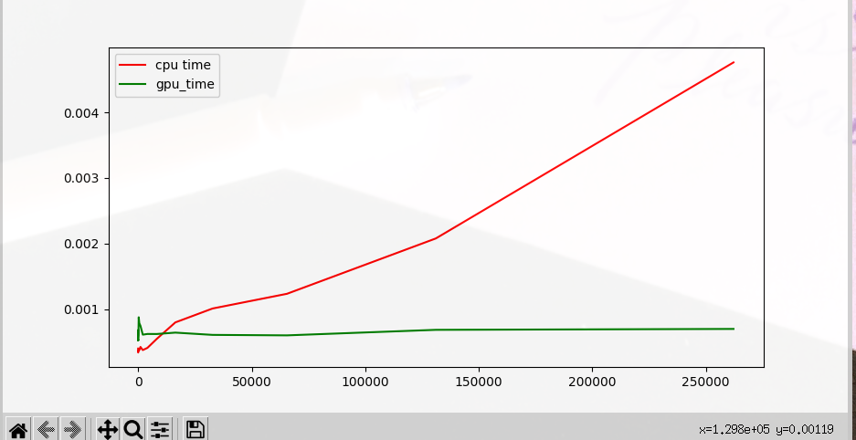

# 基本介紹

Tensorflow 2.x 版本中建議使用Eager Execution作爲主要執行的模式，當然舊的Gaph Execution依然存在，也依然能過使用Version 1的API

如要使用Graph Execution的話，必須禁用`tf.compat.v1.disable_eager_execution()`，才能順利使用Graph Execution。


## 基本運算

在Tensorflow 2.x 中要進行算，必須先將計算圖封裝於函數中，此外還必需使用`@tf.function`的修飾符號。接著呼叫此函數即可進行此運算圖。

[tf1 code](../program/base_add_tf1.py)

[tf2 code](../program/base_add.py)

## tensorflow 運算子

在Tensorflow中提供許運算子在`tf.math`中，像是`add`,`sub`,`mul`,`矩陣乘法`…等等。

[程式碼](../program/operation.py)


## tensorflow 隨機生成函數

在Tensorflow中，定義變數`tf.Variable`時，常會使用隨機函數，而隨機生成函被數定義在`tf.random`中。

[Tensorflow官網中](https://www.tensorflow.org/api_docs/python/tf/random)


## The Difference of variable and constant

[StackOverFlow](https://stackoverflow.com/questions/44745855/tensorflow-variables-and-constants)

Variable跟Constant中最大的差異，就是Variable之後 __可以__ 更改，但是Constant __不能__ 更改。如果是Variable的話，就可以直接使用`assign`指定變數的值。

[程式碼](../program/variable.py)


## 製作一個Simple Network

[code](./base_simple_network.py)

 

可以發現運用剛剛提到的`@tf.function`來製作如圖上面那樣的network其實比想像中的容易許多，只需要把需要的運算寫在函數中，接著把輸入參數寫入即可完成對應的運算。

```python
import tensorflow as tf

writer = tf.summary.create_file_writer("/tmp/tensorflow_note/tfboard_Test/")

@tf.function
def SimpleNetwork(a,b):
    c=tf.multiply(a,b,name="mul_c")
    b=tf.add(a,b,name="add_d")
    e = tf.add(c,b,name="add_e")
    return e

input_1 = tf.constant([2,3],name="input_1")
input_2 = tf.constant([3,7],name="input_2")

with writer.as_default():
    tf.summary.graph(SimpleNetwork.get_concrete_function(input_1,input_2).graph.as_graph_def())


tf.print(SimpleNetwork(input_1,input_2))
```

如果用tensorboard可以看到以下的輸出

 


## PDB In `tf.function`

在Tensorflow2.x中，新增了`tf.fuction`的方式來定義function，不需特別定義`tf.Graph`與`tf.Session`，不過實質上它是把這個python function轉成計算圖的程式碼，所以如果使用pdb進行除錯時，就會遇指向的是轉換過後的，而不是python function。

如果希望是python fuction，則需要使用`tf.config.run_functions_eagerly(True)`，才能使用。

## CPU 與 GPU 進行不同大小的矩陣計算

[程式碼](../program/cpu_and_gpu.py)

從下圖中可以看到cpu與gpu進行矩陣計算，原本CPU的運算速度是比GPU還快的，但隨著矩陣大小的增加運算速度就越來越慢。

 

## `tf.transpose` and `tf.reshape`

在許多時候，會需要用到shape的轉換，tensorflow提供了兩個不同的方式，且兩種方式都代表不同的涵意。`tf.transpose`比較像是轉罝矩陣，`tf.reshape`則是將原本的矩陣按照原本的順序進行轉換。


[tf.transpose](https://www.tensorflow.org/api_docs/python/tf/transpose)

[tf.reshape](https://www.tensorflow.org/api_docs/python/tf/reshape)


