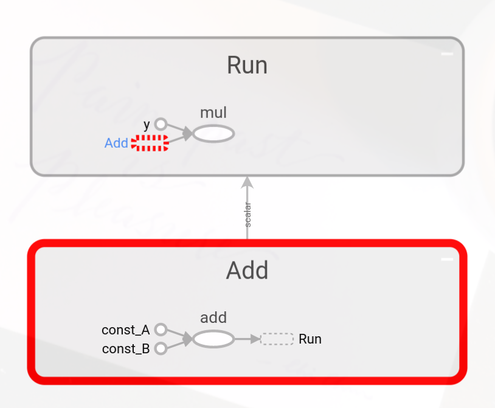

# Tensorboard

由於要直接讓其他人單純看程式碼想像撰寫出來的模型是不可能的，所以Tensorflow團隊撰寫了一個Tensorboard的工具，讓模型可視化。此外這個工具需要搭配summary一起做使用。

## tp.summary

在這個API中，他主要的工作有兩項。
1. 用於記錄單個摘要的操作
2. 編寫邏輯來收集這些單獨的摘要並將它們寫入特殊格式的日誌文件（然後 TensorBoard 讀取該文件以生成可視化）


## Tensorflow 1.x

在1.x的版本中，這兩部分必須手動連接在一起——通過Session.run() 獲取摘要操作輸出並調用 FileWriter.add_summary(output, step)。


需要透過FileWriter將要輸出的graph，當作第二個參數才能使用tensorboard輸出

```python
train_writer = tf.compat.v1.summary.FileWriter('/path/to/log', sess.graph)
```

最後將tensorboard的服務開啓，即可打開瀏覽器的 http://localhost:6006 看到輸出結果

```shell
tensorboard --logdir=<path to log>
```

 

## Tensorflow 2.x

在2.x的版本中，會自動將`tp.summary`的兩項工作自動結合。所以各個`tf.summary`操作在執行時，立即寫入數據。


`tf.summary.create_file_writer("/tmp/mylogs/eager")`取代了原本的工作`writer = tf.compat.v1.summary.FileWriter('/path/to/log', sess.graph)`，不過要注意，兩個function在執行上的功能是不一樣的。


